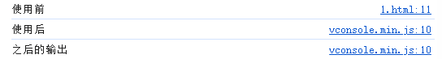
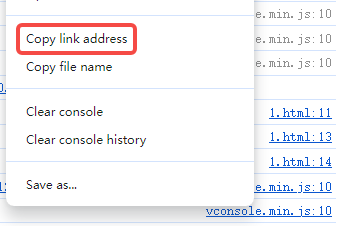
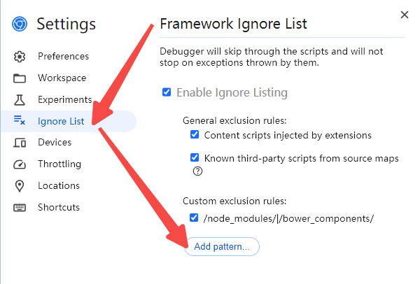

# `console.log`看不到源码位置
## 现象
使用VConsole后, 控制台展示的效果如下

```html
<script src="https://unpkg.com/vconsole@latest/dist/vconsole.min.js"></script>
<script>
    console.log(`使用前`);
    var vConsole = new window.VConsole();
    console.log(`使用后`);
    console.log(`之后的输出`);
</script>
```


在这之后所有的`console`都变成了`vconsole.min.js`的输出, 无法定位到文件源码
## 原因
`VConsole`重写了window下的`console`
## 解决方法
复制修改了console的文件链接



打开控制台的设置



添加刚刚复制的文件链接

## 相关文章
- [vConsole会破坏系统原生console.log的显示打log处文件名和行号的行为 #79](
https://github.com/Tencent/vConsole/issues/79)
- [如何避免Fundebug插件干扰Console输出](https://blog.fundebug.com/2017/11/03/disable_fundebug_during_development/)


# 还原被改写的console
## 背景
某些网站通过重写console的方式删除log
## 解决方法
```JavaScript
const iframe = document.createElement('iframe');
iframe.style.display = 'none';
document.body.appendChild(iframe);
console = iframe.contentWindow.console;
window.console = console;
```

## 相关文章
- [console.log 被重写覆盖以后如何恢复](https://blog.csdn.net/dexing7656/article/details/102114160)
- [如何恢复已禁用的console.log？](https://www.cnblogs.com/daysme/p/10067647.html)